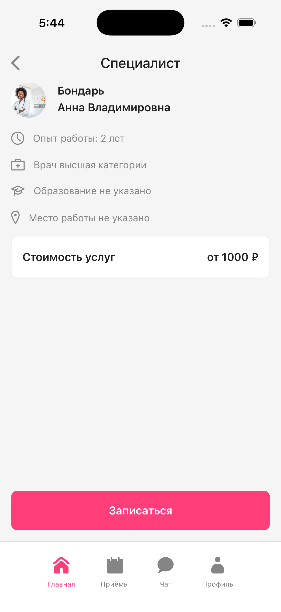
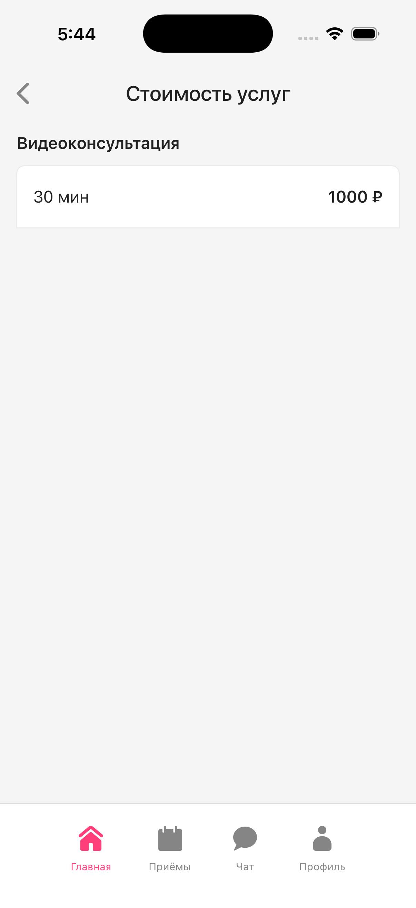

# 🩺 DoctorApp

A SwiftUI practice project — UI implementation of a doctor appointment app based on a Figma design. Built following the **MVVM architecture pattern** with clean project structure, custom navigation, and reusable components.

> 📚 This is a learning project focused on layout, architecture, and navigation — no backend involved. Doctor data is loaded from a local JSON file.

---

## 📸 Screenshots

| Home | Doctor Detail | Service Details | Search |
|:----:|:------------:|:---------------:|:------:|
|  |  |  |  |

<!-- 
To add screenshots:
1. Create a "screenshots" folder in the root of the repo
2. Add your screenshots as home.png, detail.png, services.png, search.png
3. Or replace the paths above with your actual file names
-->

---

## 🛠 Tech Stack

- **Language:** Swift
- **Framework:** SwiftUI
- **Architecture:** MVVM
- **Minimum iOS:** 17.0
- **Xcode:** 16+
- **Data:** Local JSON (Bundle)

---

## 📐 Architecture

```
DoctorApp/
├── 📁 App/                     # App entry point
├── 📁 Domain/
│   └── Models/                 # Data models (Doctor, TabItem)
├── 📁 Services/                # JSON loader
├── 📁 Navigation/              # NavigationRouter, Navigation enum
├── 📁 Presentation/
│   ├── Common/                 # Reusable components
│   │   ├── DoctorProfileHeader
│   │   ├── NavigationTopBar
│   │   └── PrimaryButton
│   ├── Home/
│   │   ├── Models/             # SortOption, SortDirection
│   │   ├── View/               # HomeView, DoctorCardView, SearchBarView
│   │   └── ViewModel/          # HomeViewModel
│   ├── DoctorDetail/
│   │   └── View/               # DoctorDetailView, ServiceDetailsView
│   ├── MainTabBar/
│   │   └── View/               # MainTabBarView
│   ├── Appointments/
│   ├── Chat/
│   └── Profile/
└── 📁 Resources/               # Assets, doctors.json
```

---

## ✨ Features

- 🏠 **Home Screen** — list of doctor cards with search and sort functionality
- 🔍 **Search** — real-time filtering by name and specialization with debounce
- 📊 **Sort** — by price, experience, and rating (ascending / descending)
- 👨‍⚕️ **Doctor Detail** — profile with experience, category, education, and workplace
- 💰 **Service Details** — pricing for video consultation, chat, and clinic visits
- 🧭 **Custom Navigation** — programmatic navigation via NavigationRouter with preserved state per tab
- 📑 **Custom TabBar** — bottom tab bar with animated selection
- 🖼 **Async Images** — avatar loading with timeout fallback and placeholder
- 🎨 **Reusable Components** — PrimaryButton, DoctorProfileHeader, NavigationTopBar

---

## 🚀 Getting Started

1. Clone the repository
```bash
git clone https://github.com/55kt/DoctorApp.git
```

2. Open `DoctorApp.xcodeproj` in Xcode

3. Select a simulator or device (iOS 17.0+)

4. Build and run (**⌘ + R**)

---

## 📄 License

This project is for educational purposes only.
